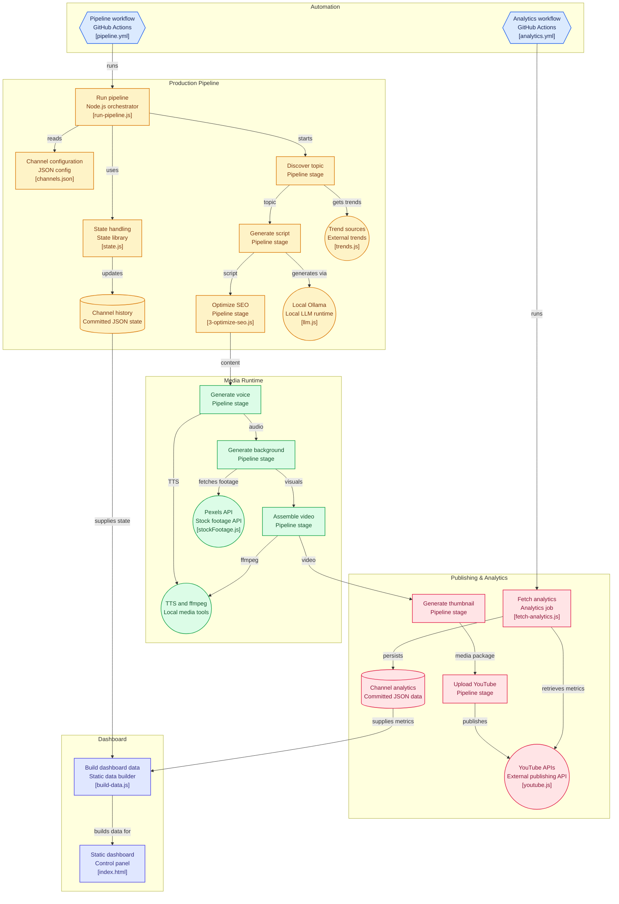

# YouTube Autopilot

Two parts:

- **`backend/`** — the real automation pipeline. Topic discovery (daily
  trends, or a curated evergreen topic pool for channels that define
  one) → local Ollama script generation → free TTS voiceover →
  generated background video (real stock footage via Pexels' free API,
  or a gradient fallback) → ffmpeg assembly → thumbnail → YouTube
  upload, scheduled via GitHub Actions cron with zero human review and
  zero paid APIs. Each channel publishes both short-form and long-form
  videos, each on its own cadence. Start here: `backend/README.md`.
- **`frontend/`** — a control-panel dashboard UI (`frontend/index.html`)
  showing real pipeline/channel state pulled from the backend (publish
  history, last run's actual per-stage status, recent workflow runs).
  See `frontend/README.md` to run it.

## Architecture

## Status

This repo is live: connected to GitHub, public, and running on its
cron schedule (`.github/workflows/pipeline.yml`) with no human
checkpoint. Being public means GitHub Actions minutes are unlimited and
free regardless of schedule — no billing risk. To add a new channel or
change cadence, edit `backend/config/channels.json` and the cron
entries in the workflow file; see `backend/README.md` for the full
setup/config reference.
